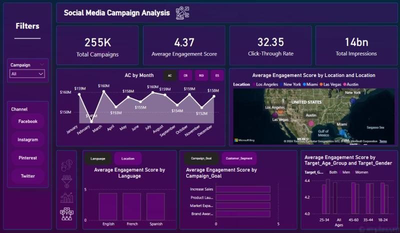

# 📊 Social Media Campaign Analysis

This project analyzes social media advertising campaigns using Power BI. The goal is to uncover actionable insights from campaign data across various platforms, demographics, and time periods to optimize future marketing strategies.

---

## 📌 Project Overview

Social media has become a crucial marketing and intelligence tool. This project evaluates 30,000 ad campaigns conducted in 2022 across platforms like Facebook, Twitter, Instagram, and Pinterest. Using Power BI, key performance metrics were visualized and analyzed to determine what works best—and what doesn't—across different age groups, genders, cities, and campaign goals.

---

## 📊 Power BI Dashboard Overview

  

---

## 📂 Dataset

- **Rows**: 30,000
- **Columns**: 16
- **Platforms Covered**: Facebook, Instagram, Twitter, Pinterest
- **Demographics**: Gender, Age Group
- **Locations**: Las Vegas, New York, Austin, Los Angeles, Miami
- **Metrics**: Acquisition Cost, ROI, Engagement Score, Conversion Rate

---

## 🔍 Key Findings

- 📈 **High Conversion**: 18–24 age group had the highest conversion rates.
- 💸 **Cost Efficiency**: 25–34 age group had the lowest acquisition cost.
- 📅 **Seasonal Trends**: Engagement and conversion peaked in March–April and year-end.
- 🌐 **Channel Performance**:
  - Instagram & Twitter performed consistently well.
  - Pinterest underperformed in all metrics.
- 🌍 **Cultural Factors**: Spanish and English dominated due to coastal city demographics.
- 🎯 **Campaign Goals**: Market Expansion campaigns led in conversion and cost-efficiency.

---

## ✅ Recommendations

- Focus on campaigns targeting the 18–24 age group for better conversion.
- Reallocate budget from Pinterest to more effective platforms.
- Align major campaigns with high-engagement periods (March–April, year-end).
- Localize content in Spanish and English for better regional impact.

---

## 📎 Report Contents

- Introduction and Motivation
- Scope and Assumptions
- Data Preprocessing and Modeling
- Visual Insights & Dashboards
- Recommendations
- Conclusion

📄 **Full Report**: See `Social Media Campaign Analysis Project Report.pdf`

---

## 🛠 Tools Used

- **Power BI**: Dashboard creation, data visualization
- **Excel / CSV**: Data preprocessing
- **DAX**: Calculated columns and measures

---

## 📧 Contact

**Zohaib Saqib**  
📧 zohaibsaqib803@gmail.com  
🔗 [LinkedIn](https://www.linkedin.com/in/muhammadzohaibsaqib)

---

> This project is part of a data analytics portfolio showcasing real-world marketing insights powered by data.
